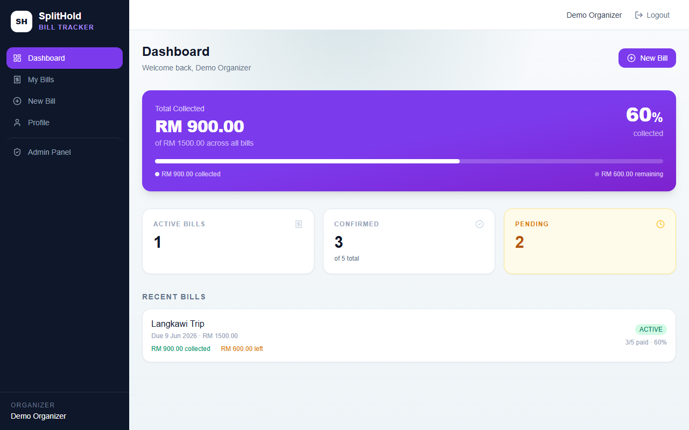
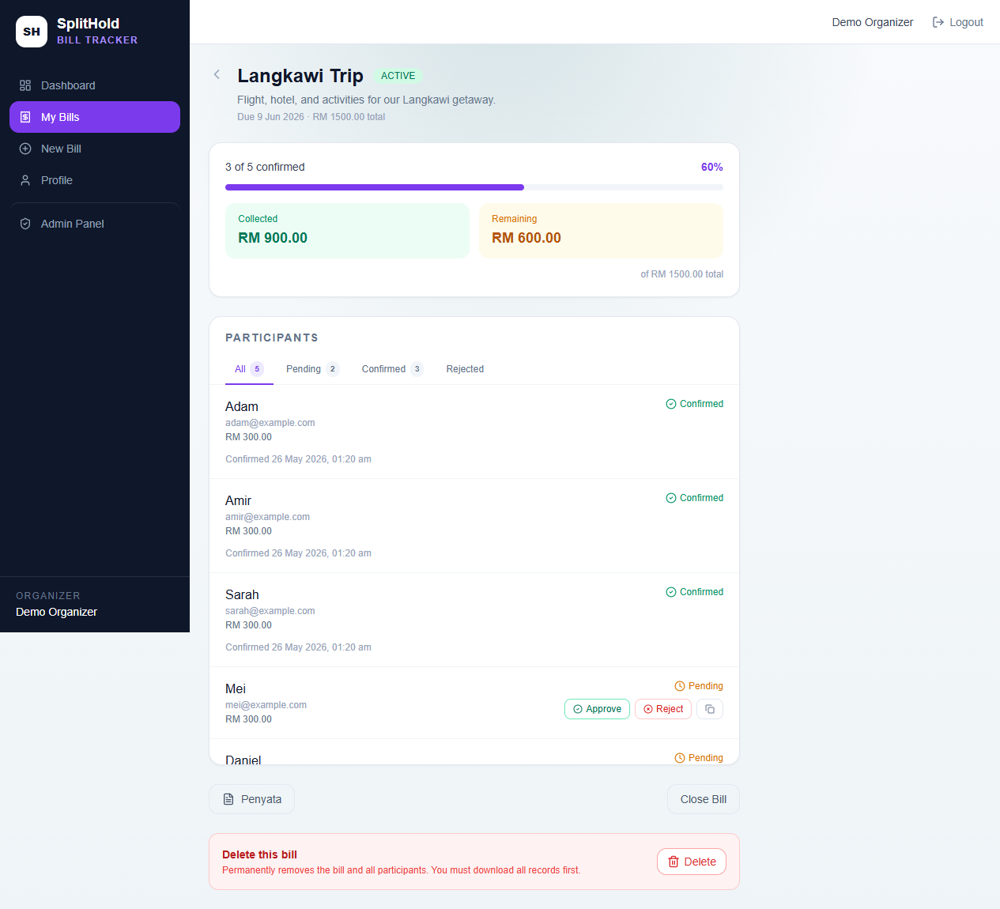
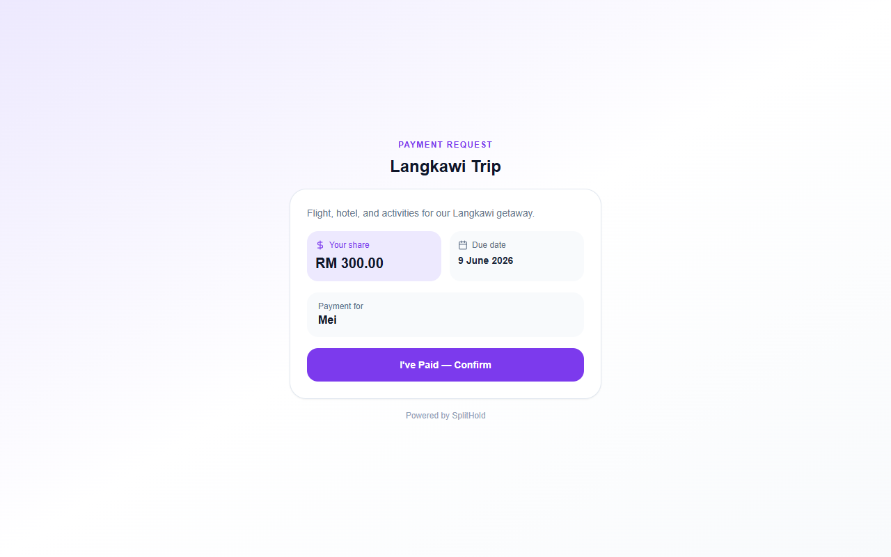
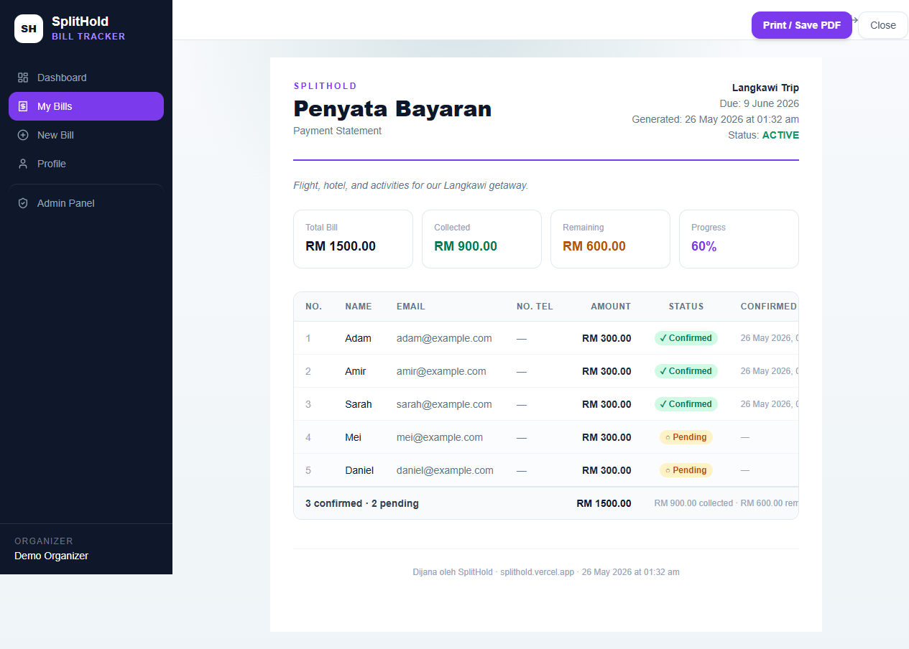

# SplitHold

> Split bills. Track who's paid. No group chat needed.

SplitHold is a focused bill-collection tool for organisers — create a bill, generate a unique payment link per person, share it, and watch confirmations come in. Members confirm with one tap. No account. No friction.

**Live demo:** [splithold.vercel.app](https://splithold.vercel.app)  
**Demo login:** `demo@splithold.local` / `SplitHoldDemo123!`

---

## The Problem

You're collecting money from a group — a trip, a dinner, a shared expense. You end up juggling a WhatsApp thread, manually tracking who's paid, sending awkward reminders. SplitHold replaces all of that with a link.

---

## How It Works

```
Organiser creates bill → App generates one link per person
→ Share via WhatsApp / Telegram / email
→ Member opens link, taps "I've Paid"
→ Organiser sees live confirmation dashboard
```

No group account. No app install. The member just needs the link.

---

## Screenshots

### Dashboard — live progress at a glance



### Bill Detail — participants, amounts, approve/reject



### Member Pay Page — no account needed



### Penyata Bayaran — printable payment statement



---

## Features

| Feature | Description |
|---|---|
| **Bill creation** | Title, total, due date, per-participant amounts, bank transfer details |
| **Unique pay links** | Each participant gets `/pay/[uuid]` — shareable, no login required |
| **Open registration** | Optionally let members self-register via `/join/[token]` |
| **Payment proof** | Members can upload a payment screenshot as proof |
| **Approve / Reject** | Organiser reviews and confirms each payment |
| **Live dashboard** | Real-time collected / remaining / progress per bill |
| **Penyata Bayaran** | Printable statement with bank details and full participant table |
| **Forgot password** | Admin-fulfilled temp password flow via email (Resend) |
| **Admin panel** | User management, bill oversight, activity log, password resets |
| **Mobile-first** | All views tested on mobile — horizontal scroll, responsive grids |

---

## Tech Stack

| Layer | Choice | Why |
|---|---|---|
| Framework | Next.js 16 (App Router) | Server components, API routes, clean file-based routing |
| Database | Supabase (PostgreSQL + RLS) | Row-level security, Supabase Storage for proof uploads |
| Auth | Custom JWT + bcrypt | httpOnly cookie, 8h session, no third-party dependency |
| Email | Resend | Transactional emails for temp passwords |
| Styling | Tailwind CSS | Utility-first, custom purple brand token (`brand-primary`) |
| Hosting | Vercel | Zero-config deploy, edge functions |

---

## Routes

| Route | Access | Description |
|---|---|---|
| `/` | Public | Landing page |
| `/login` · `/register` | Public | Organiser auth |
| `/forgot-password` | Public | Request password reset |
| `/dashboard` | Auth | Bill overview + financial stats |
| `/bills` | Auth | All bills list |
| `/bills/new` | Auth | Create bill with participants |
| `/bills/[id]` | Auth | Bill detail — participants, approve/reject, copy links |
| `/bills/[id]/statement` | Auth | Printable Penyata Bayaran |
| `/pay/[token]` | Public | Member confirmation — no account needed |
| `/join/[join_token]` | Public | Self-registration for open bills |
| `/profile` | Auth | Profile + avatar + password change |
| `/admin` | Admin | Overview stats |
| `/admin/users` | Admin | User management |
| `/admin/bills` | Admin | All bills across all users |
| `/admin/password-resets` | Admin | Fulfill reset requests |
| `/admin/activity-log` | Admin | Full audit trail |

---

## Schema

```sql
users (id, email, password_hash, name, role, avatar_url)

bills (
  id, organizer_id, title, description,
  total_amount_cents, due_date, status,
  bank_name, bank_account_number, bank_account_name,
  join_token, allow_self_registration
)

bill_participants (
  id, bill_id, name, email, phone_number, amount_cents,
  payment_token uuid UNIQUE,
  status,           -- PENDING | CONFIRMED | REJECTED
  confirmed_at,
  proof_path        -- Supabase Storage path
)
```

All money stored as **integer cents** — RM 48.00 = `4800`. No floating-point rounding errors.

---

## Local Setup

```bash
# 1. Install dependencies
npm install

# 2. Copy env template
cp .env.example .env.local
# Fill in your Supabase keys and JWT_SECRET

# 3. Start dev server
npm run dev

# 4. Seed demo data (optional)
npm run seed:demo
```

### Environment Variables

```env
NEXT_PUBLIC_SUPABASE_URL=https://your-project-ref.supabase.co
NEXT_PUBLIC_SUPABASE_ANON_KEY=...
SUPABASE_SERVICE_ROLE_KEY=...     # Supabase → Settings → API
JWT_SECRET=...                    # openssl rand -base64 32
RESEND_API_KEY=...                # resend.com (optional — for email)
NEXT_PUBLIC_APP_URL=http://localhost:3000
```

---

## Demo Data

`npm run seed:demo` creates:

- **Account:** `demo@splithold.local` / `SplitHoldDemo123!`
- **Bill:** "Langkawi Trip" — RM 1,500 total, 5 participants at RM 300 each
- **Status:** 3 confirmed (Adam, Amir, Sarah) · 2 pending (Mei, Daniel)

Log in, open the Langkawi Trip bill, copy Mei's payment link, open it in another tab — that's the full flow in under a minute.

---

## Built For

**Kracked Devs Bounty — RM 500 · Deadline 2026-06-01**
